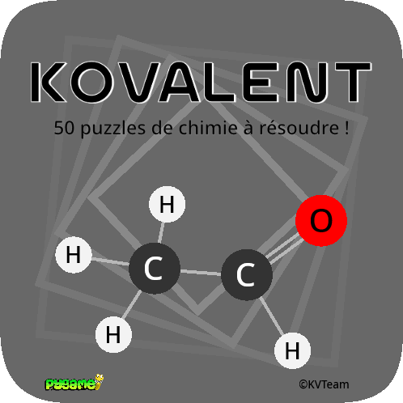

# Kovalent
\
<br>
**Projet 3 de NSI**\
A retrouver sur notre [github](https://github.com/kimivictor2009/Kovalent)\
Voir "présentation.md" pour plus d'informations sur le projet

## Pour lancer le projet
- Ouvrez le répertoire "code"
- Ouvrez le fichier "main.py" avec python
- Exécutez le code
> [!IMPORTANT]
> **Vous devez avoir installé certains modules, tel que pygame ou screeninfo : vous pouvez les installer avec "requirements.txt"**\
> Vous pouvez utiliser :
```shell
pip install -r requirements.txt
```

## Pour jouer
Une fois le programme lancé, vous trouverez les instructions dans le jeu. Elles précisent le but du jeu, comment jouer, la progression et quelques atomes. Vous en découvrirez plus en jouant !

## Répertoire
📂 **Kovalent**\
├── 📂 **sources**\
│   └── main.py              - _Programme principal du jeu_\
├── 📂 **data**\
│   ├── atome.json           - _Base de données des atomes du jeu_\
│   ├── icon.png             - _Icone du jeu_\
│   ├── lock.png             - _Image des niveaux bloqués_\
│   ├── niveau.json          - _Base de données des niveaux du jeu_\
│   ├── restart.png          - _Image du bouton qui réinitialise la position des atomes_\
│   └── title.png            - _Image du titre_\
├── Affiche_Kovalent.png     - _Affiche du jeu_\
├── presentation.md          - _Documentation détaillée_\
├── requirements.txt         - _Dépendances_\
├── Cahier_de_projet.odt     - _Cahier de projet_\
├── license.txt              - _License_\
└── README.md                - _Vous êtes ici_

## Contact
Vous pouvez nous contacter, poser des questions, vous renseigner, à l'adresse suivante : <kimivictor@proton.me>
